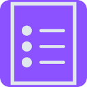

# README
# exTimesion
#### CIS-3500 Project
#### Team 10

## Logo

## How to Run:
1. Download the repository.
2. Navigate to the `tabs-example` directory.
3. Run `npm install` to install dependencies.
4. Run `npm run build` to build the extension locally.
5. Navigate to your extension manager in Chrome and load the unpacked extension by selecting the `tabs-example` directory.
6. Use!

## How to Use:
- **Tab Tracking:** exTimesion begins to track any tabs that are opened and then visited.
- **Tab Open Time:** Displays the amount of time since the tab has simply been opened and alive on your browser.
- **Tab Focus Time:** Displays the amount of time the tab has been looked at (i.e. how much time you've actually spent on that tab).
- Both times last across sessions, so you can switch between other applications (e.g., writing an essay on Word and revisiting Chrome) and still see your tab times tracked after they are retrieved from the Chrome cache.
- **Group Active Tabs:** Use the `Group Active tabs` button to group all current active tabs into a tab group.
- **Close Tabs:** For each tab there is an associated trashcan icon, which when pressed, closes out the tab you choose.

## Team Members:
- Rayan Yu
- Andrew Zhen
- Max Mercado
- Duriya Rehan

## Additional Resources:
- [Link to video](https://youtu.be/8Sm2bGfN0NU)
- [Link to landing page](https://maxmerc.github.io/exTimesion-landing-page/)

## Issues:
If you have any issues, please file comments in the Issues section of the repository.

## Screenshots:

